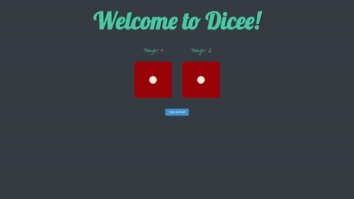

# Dicee 🎲

A fun, simple web-based dice game where two players can roll virtual dice to compete against each other. 

## Table of Contents
- [Demo](#demo)
- [Technologies Used](#technologies-used)
- [Features](#features)
- [Getting Started](#getting-started)
- [Installation](#installation)
- [Contributing](#contributing)

## Demo
Check out the live demo [here](#).



## Technologies Used
- **HTML** - For the structure of the webpage
- **CSS** - For styling the interface
- **JavaScript** - To handle dice roll logic and interactivity

## Features
- Roll two dice for Player 1 and Player 2 with a click of a button
- Random number generation for each dice roll
- Display dice faces based on the result of each roll
- Display winner or draw message based on dice rolls

## Getting Started
To get a local copy up and running, follow these simple steps.

### Prerequisites
Make sure you have a modern browser installed (e.g., Chrome, Firefox).

### Installation
1. Clone the repository:
    ```bash
    git clone https://github.com/shafayat666/dicee.git
    ```
2. Navigate to the project directory:
    ```bash
    cd dicee
    ```
3. Open `dicee.html` in your preferred browser.

### JavaScript Explanation
The game functionality is managed by the `rollDice` function, which is triggered when the button is clicked:
- **`randomNum` Function:** Generates a random number between 1 and 6.
- **Player Numbers:** Two variables, `player1Num` and `player2Num`, are created to store random dice values for each player.
- **Dynamic Image Source:** The dice images change based on the random values generated.
- **Winner Declaration:** Updates the main heading (`h1`) to display the result: Player 1 wins, Player 2 wins, or a draw.

Here is the JavaScript code:
```javascript
document.querySelector("button").addEventListener("click", rollDice);

function rollDice() {
    function randomNum() {
        var randomNumber = Math.floor(Math.random() * 6) + 1;
        return randomNumber;
    }
    
    var player1Num = randomNum();
    var player2Num = randomNum();
    
    document.querySelector(".img1").src = "./images/dice" + player1Num + ".png";
    document.querySelector(".img2").src = "./images/dice" + player2Num + ".png";
    
    if (player1Num > player2Num) {
        document.querySelector("h1").innerHTML = "Player 1 Wins!🚩"
    } else if (player1Num < player2Num) {
        document.querySelector("h1").innerHTML = "Player 2 Wins!🚩"
    } else {
        document.querySelector("h1").innerHTML = "It's a draw."
    }    
}
```

## Contributing

Contributions are what make the open-source community such an amazing place to learn, inspire, and create. Any contributions you make are greatly appreciated.